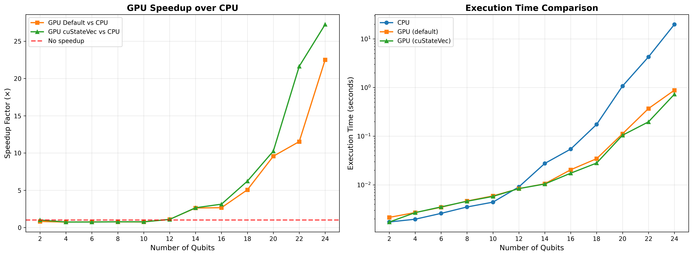
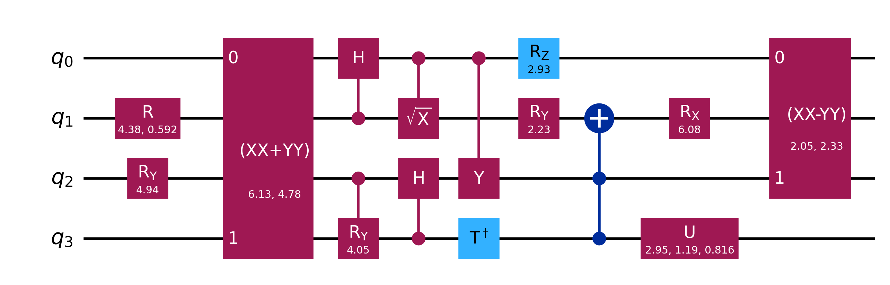

## Overview

CPU and GPU performance comparison for quantum circuit simulations using [Qiskit Aer](https://qiskit.github.io/qiskit-aer/stubs/qiskit_aer.AerSimulator.html). Primarily evaluates execution time and speedup factors across different backend configurations, including GPU acceleration with [NVIDIA's cuStateVec library](https://developer.nvidia.com/cuquantum-sdk#custatevec).

<!-- - Analyzes memory requirements and precision trade-offs
- Generates comprehensive performance visualizations -->

<!-- - justification for transpilation
- benchmark envs
- justification for precison
- example circuit -->

## Roadmap

- [x] Benchmark Qiskit Aer CPU and GPU backends
- [x] Compare cuStateVec-enabled vs default GPU execution
- [x] Analyze floating-point precision impact (double vs single)
- [ ] Explore custom backend implementations
- [ ] Add memory profiling and optimization analysis
- [ ] Implement distributed multi-GPU benchmarking

### **Key Findings (so far):**
- **GPU with cuStateVec**: Up tp 25× speedup over CPU for 24-qubit circuits
- **GPU default**: Up to 20× speedup without cuStateVec optimization

## Results Visualization

## Benchmark Environment

### Current Platforms

**Google Colab (Primary)**
- GPU: NVIDIA Tesla T4 (16GB VRAM)
- CUDA Version: 12.x
- Python: 3

**University of Luxembourg (UniLu) Iris Cluster**
- GPU: NVIDIA Tesla V100 (32GB VRAM)
- Status: Limited availability (access issues being resolved)
- Intended for large-scale benchmarks (>30 qubits)

## Memory Impact

**Data type**(default): Complex128 (double precision complex)

**Size per amplitude**: 16 bytes (128 bits)
- 8 bytes for the real part (float64)
- 8 bytes for the imaginary part (float64)

State vector memory grows exponentially with qubit count

| Qubits | Amplitudes ($2^n$) | Memory (Double) | 
|--------|---------------------|-----------------|
| 10 | 1,024 | 16 KB |
| 15 | 32,768 | 512 KB |
| 20 | 1,048,576 | 16 MB |
| 25 | 33,554,432 | 512 MB |
| 30 | 1,073,741,824 | 16 GB |
| 32 | 4,294,967,296 | 64 GB |

## Methodology

### Circuit Generation

Random quantum circuits are generated using Qiskit's `random_circuit()` function with the following parameters:
- Qubit range: 2-24 qubits (increments of 2)
- Circuit depth: 10 layers
- Gate set: `['x', 'y', 'z', 'h', 's', 't', 'cx', 'rx', 'ry', 'rz']`

### Transpilation

The random circuit generator produces composite gates (e.g., `rxx`, `ryy`, `rzz`) that are not natively supported by all simulator backends. Transpilation to basic gates ensures identical quantum operations across CPU and GPU backends

## References

- [Qiskit Documentation](https://qiskit.org/documentation/)
- [Qiskit Aer GPU Documentation](https://qiskit.github.io/qiskit-aer/)
- [NVIDIA cuStateVec](https://developer.nvidia.com/custatevec)